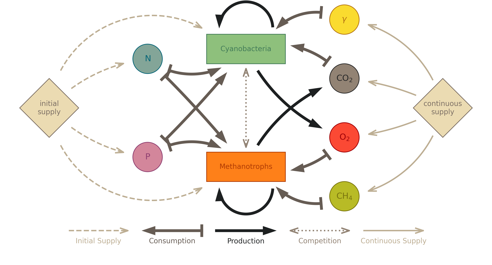

# Model for the Concentration Dynamics in Mixed-Species Cultures

Here, we model the concentration dynamics of a liquid suspended culture with two species, cyanobacteria and methanotrophs, competing for resources. A graphical representation of the system is shown below:

At this time, a full implementation of the current version of the model is available in the Jupyter notebook `suspended_cultures_sim_v2.ipynb`. However, in order to make the model easier to understand and use, the implementation is being refactored into distinct units:

## Files
This repository contains the following (relevant) files:

### Executable Code
- `Liquid Cell Culture Dynamics.ipynb`: Jupyter notebook implementing a simulation of the model and visualizing the simulation results.
- `concentration_dynamics.py`: Python module containing the implementation of the decscribed model.
- ~~`params.py`: Python module containing the logic to load and process parameters from the serial files.~~
- `suspended_cultures_sim_v2.ipynb`: Jupyter notebook containing the original implementation of the model, to be removed once the refactored implementation is complete.

### Serial Files
- `constants.yml`: Serial file containing constant parameters used in the simulations.
- `parameters.yml`: Serial file containing default values for parameters that may be changed in the real experiment.

### Documentation
- `README.md`: This file, containing the description of the model for the concentration dynamics in mixed-species cultures.
- `reaction_scheme.png`: Graphical representation of the reaction scheme.

## System Description
The model describes the behaviour of the concentrations of the following species (🦠 biological and 🧪 chemical) over time:
- (A) **🦠 Cyanobacteria**, specifically *A. platensis*
- (H) **🦠 Methanotrophic bacteria**, specifically *M. capsulatus* or *M. methanica*
- (C) **🧪 carbon dioxide**
- (O) **🧪 oxygen**
- (M) **🧪 methane**
- (L) **🧪 light**, counting photons in moles the same way we usually do molecules.
- (N) **🧪 nitrogen**
- (P) **🧪 phosphorous**

The concentration of each species at any given point in time $t$ is a scalar, representing
- (for 🦠A/H) the concentration of biomass in a volume element of the culture, in units of mol C/m³
- (for 🧪C/O/M/N/P) the molar concentration of nutrient molecules in a volume element of the culture, in units of mol/m³
- (for 🧪L) the average molar concentration of photons over the volume of the culture, in units of mol/m³

Note that we will be working in SI base units throughout this model, so, diverging from the usual conventions of microbiology etc, we will be measuring time in seconds (s), volume in cubic metres (m³), and amount of substance in moles (mol).

We describe the behaviour of the concentrations over time by a system of first-order ordinary differential equations, which we derive from the interactions between the components of the system.

## Interactions
The dynamics of the concentrations are driven by the interactions between the species, which are described in the following:

1. **Bacterial Proliferation:** New bacteria are produced by existing bacteria. 

2. **Nutrient Consumption:** In the process of proliferation, the bacteria remove nutrients from the solution. 
- Special case: **Light Absorption.** Since any photons not absorbed by the bacteria are immediately lost and replaced by new photons from the light source, this nutrient species requires special treatment.

3. **Gas Production:** Some nutrients are produced as by-products of bacterial metabolism. We assume two contributions to the gas production. 

4. **Gas Exchange:** The culture is continuously supplied with some nutrients in gaseous form. 

5. **Bacterial Competition:** Once a critical concentration is reached, the bacteria compete for space. For now, we assume that, the total amount of biomass being limited by the nutrients in finite supply (N&P), this point will never be reached.

Each of these interactions is described in more detail below:

### Bacterial Proliferation and the Multiplicative Monod Model
The proliferation of each biological species $🦠$ is described by 

$$ \partial_t \, c_🦠 = \mu_🦠 \cdot c_🦠 $$

with the growth rate $\mu_🦠$. 

The growth rate $\mu$ of each biological species depends on the concentrations of the nutrients available to it. In the case of one limiting nutrient, this relationship is often modelled using the Monod equation: $$\mu = \mu_{\mathrm{max}} \cdot \frac{c}{c^\mathrm{half}+c}\ ,$$ where $c$ is the concentration of the limiting nutrient, $\mu_{\mathrm{max}}$ is the maximum growth rate of the biological species, and $c^\mathrm{half}$ is the half-saturation constant, which is specific both to the proliferating biological species and the nutrient considered. In the case of multiple limiting nutrients, we use the **multiplicative Monod model:** 

$$ \mu_{🦠}(c_\cdots) = \mu_{\max,🦠} \cdot \prod_{🧪} \frac{c_{🧪}}{c^\text{half}_{🦠,🧪} + c_{🧪}} $$

### Nutrient Consumption

The associated consumption rate of each required nutrient species $🧪$ is described by 

$$ \partial_t\,c_🧪 = \bar{Y}_{🦠\leftarrow🧪} \cdot \mu_🦠 \cdot c_🦠 $$

with the growth-to-consumption coefficent $\bar{Y}_{🦠\leftarrow🧪}$.

> #### Special Case: Light Absorption
> to do

### Gas Production
Most of the gas is produced by bacteria in the process of proliferation (growth-associated part), but some is also produced independently of ongoing proliferation (non-growth-associated part). For each nutrient species $🧪$: 

$$\partial_t\,c_🧪 = \underbrace{ ~\alpha_{🦠\to🧪} \cdot \mu_{🦠}(c_\cdots) \cdot c_{🦠}~ }_{ \text{growth-associated} } + \underbrace{ ~\beta_{🦠\to🧪} \cdot c_{🦠}~ }_{ \text{non-growth-associated} }$$

with the growth-associated production coefficent $\alpha_{🦠\to🧪}$ and the non-growth-associated production coefficent $\beta_{🦠\to🧪}$, where $🦠$ represents the biological species. 

### Gas Exchange
For each of these nutrients $🧪$: 

$$\partial_t c_{🧪} = k_{\text{La},🧪} \cdot \left( \frac{p_{🧪}}{H_{🧪}} - c_{🧪} \right)$$

### Summary of the Dynamics
The mathematical relationships between the instantaneous concentrations of the species and the reaction rates are as follows:

$$
\begin{aligned}
\text{Bacterial Proliferation Rates:} && \frac{\mathrm{d}}{\mathrm{d}t}c_{🦠} &= \mu_{🦠}(c_{\cdots}) \cdot c_{🦠} && \text{(I)}
\\\text{Multiplicative Monod Model:} && &\quad~ \mu_{🦠}(c_\cdots) = \mu_{\max,🦠} \cdot \prod_{🧪} \frac{c_{🧪}}{c^\text{half}_{🦠,🧪} + c_{🧪}}
\\ \text{Nutrient Consumption Rates:} && \frac{\mathrm{d}}{\mathrm{d}t} c_{🧪} &= \frac{-1}{Y_{🦠\leftarrow🧪}} \cdot \mu_{🦠}(c_\cdots) \cdot c_{🦠} && \text{(II)}
\\ \text{Gas Production:} && \frac{\mathrm{d}}{\mathrm{d}t}c_{🧪} &= \underbrace{ \alpha_{🦠\to🧪} \cdot \mu_{🦠}(c_\cdots) \cdot c_{🦠} }_{ \text{growth-associated} } + \underbrace{ \beta_{🦠\to🧪} \cdot c_{🦠} }_{ \text{non-growth-associated} } && \text{(III)}
\\ \text{Gas Exchange:} && \frac{\mathrm{d}}{\mathrm{d}t} c_{🧪} &= k_{\text{La},🧪} \cdot \left( \frac{p_{🧪}}{H_{🧪}} - c_{🧪} \right) && \text{(IV)}
\end{aligned}
$$

Here, 🦠 indicates any bacterial species and 🧪 indicates any nutrient species. 

~~Some of the parameters named here are, themselves, functions of the state of the system or otherwise well-defined through some mathematical model. In the following, we describe how we model these dependencies in more detail:~~

## Parameters

To implement this model, various parameters need to be specified. These are listed in the following:

### Maximum Growth Rates $\mu_{\max,🦠}$
- $\mu_{\mathrm{max,A}}:$ the maximum growth rate of cyanobacteria, in units of 1/s. 
- $\mu_{\mathrm{max,H}}:$ the maximum growth rate of the methanotrophs, in units of 1/s. 

Note: The growth rate relates to the doubling time as $\mu = \ln2 / T_\mathrm{double}$

### Half-saturation concentrations $c^\mathrm{half}_{🦠,🧪}$
Not every nutrient is limiting for each biological species. (Refer to the reaction scheme above) The following half-saturation concentrations are relevant:
- $c^\mathrm{half}_{A,C}:$ the concentration of carbon dioxide (🧪C) at which the growth rate of cyanobacteria (🦠A) is half its maximum if not otherwise limited. (units of mol/m³)
- $c^\mathrm{half}_{A,L}:$ the concentration of photons (🧪L) at which the growth rate of cyanobacteria (🦠A) is half its maximum if not otherwise limited. (units unclear)
- $c^\mathrm{half}_{A,N}:$ the concentration of nitrogen (🧪N) at which the growth rate of cyanobacteria (🦠A) is half its maximum if not otherwise limited. (units of mol/m³)
- $c^\mathrm{half}_{A,P}:$ the concentration of phosphorous (🧪P) at which the growth rate of cyanobacteria (🦠A) is half its maximum if not otherwise limited. (units of mol/m³)

- $c^\mathrm{half}_{H,M}:$ the concentration of methane (🧪M) at which the growth rate of methanotrophs (🦠H) is half its maximum if not otherwise limited. (units of mol/m³)
- $c^\mathrm{half}_{H,O}:$ the concentration of oxygen (🧪O) at which the growth rate of methanotrophs (🦠H) is half its maximum if not otherwise limited. (units unclear)
- $c^\mathrm{half}_{H,N}:$ the concentration of nitrogen (🧪N) at which the growth rate of methanotrophs (🦠H) is half its maximum if not otherwise limited. (units of mol/m³)
- $c^\mathrm{half}_{H,P}:$ the concentration of phosphorous (🧪P) at which the growth rate of methanotrophs (🦠H) is half its maximum if not otherwise limited. (units of mol/m³)

